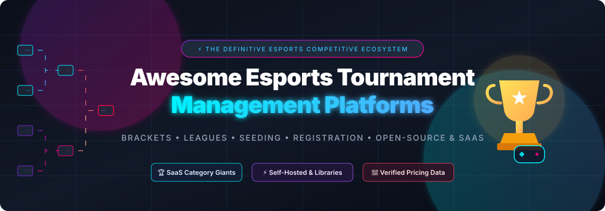

  

  
  
  
  
  
  

---

# 🎮 Awesome Esports Tournament Management Platforms

> 🏆 **A curated directory of top Esports Tournament Management platforms, bracket generation engines, match reporting software, seeding algorithms, and self-hosted open-source esports systems.**

Whether you are organizing grassroots community tournaments, university leagues, fighting game gatherings (FGC), or multi-stage enterprise esports circuits, this list provides comprehensive insight into industry-standard **SaaS platforms** and **open-source developer tools**.

---

## 📑 Table of Contents
- [🌟 Overview & Ecosystem](#-overview--ecosystem)
- [🏢 SaaS & Hosted Platforms](#-saas--hosted-platforms)
- [💻 Open-Source GitHub Projects](#-open-source-github-projects)
- [🛠️ Developer Libraries & Bracket Generators](#-developer-libraries--bracket-generators)
- [🤝 How to Contribute](#-how-to-contribute)
- [📈 Star History](#-star-history)
- [⚖️ Disclaimer](#-disclaimer)

---

## 🌟 Overview & Ecosystem

Tournament management software automates critical competitive operations:
- 📊 **Bracket Generation & Progression**: Single Elimination, Double Elimination, Round Robin, Swiss System, Free-For-All (FFA), and Multi-Stage Group Stages.
- 🎯 **Seeding & Matchmaking**: Elo/Glicko-2 seeding, MMR ranking, random draws, and manual seeding adjustments.
- 📝 **Registration & Check-In**: Participant management, team rosters, wave scheduling, and attendance verification.
- ⏱️ **Match Scheduling & Score Reporting**: Real-time dispute management, API integration, and Discord bot automation.
- 💰 **Prize Pool & Monetization**: Escrow payouts, crowdfunding drives, SponsorQuests, and entry fee processing.

---

## 🏢 SaaS & Hosted Platforms

*Sorted by company valuation / market scale (descending).*

| 🏆 Platform | 📊 Company Valuation / Scale | 🎯 Overview & Key Capabilities | 💳 Pricing (Starting Tier) | 🎁 Free Tier Limits |
| :--- | :--- | :--- | :--- | :--- |
| **[Start.gg](https://www.start.gg/)** | **~$3.1+ Trillion Parent Market Cap** (Microsoft Subsidiary; ~$50M–$100M division) | Premier grassroots and FGC tournament platform (formerly Smash.gg) with venue check-in, pool wave management, and stream queue integration. | **6% platform fee** per paid participant ticket (+ standard payment processing via Stripe/PayPal) | **Free forever**: 100% free with **unlimited participants and brackets** for free-entry tournaments (0% platform fee when entry is free). |
| **[Repeat.gg](https://repeat.gg/)** | **~$100+ Billion Parent Market Cap** (Sony Interactive Entertainment Subsidiary) | Automated asynchronous tournament and leaderboard platform (Sony-acquired; operations ceased mid-2026). | **Defunct / Ceased Operations** (Historically free entry with cash/coin leaderboard wagers) | **Service Discontinued**: Previously offered free-entry daily tournaments; active operations wound down in mid-2026. |
| **[Challonge](https://challonge.com/)** | **~$14+ Billion Parent Market Cap** (Logitech G Subsidiary; ~$15M–$25M division) | Lightweight and ubiquitous bracket generator supporting single/double elimination, round-robin, and Swiss formats with public embeds. | **$6.99/month** (Premier billed annually) or **$7.99/month** (billed monthly); 14-day free trial available | **Free forever**: Unlimited tournaments up to **256 participants** per tournament (**16 participants** for FFA format); ad-supported pages. |
| **[FACEIT](https://www.faceit.com/)** | **$1.5 Billion Valuation** (ESL FACEIT Group / Savvy Games Group; acquired for $500M) | Comprehensive competitive platform offering automated server orchestration, server-side anti-cheat, leagues, and tournament hubs. | **Free for organizers** (Optional player subscriptions: **$6.99/month** for FACEIT Plus, **$10.99/month** for FACEIT Premium) | **Free forever**: Unlimited tournament creation, automated matchmaking brackets, public Elo tracking, and anti-cheat integration. |
| **[ESL Play / FACEIT](https://play.eslgaming.com/)** | **$1.5 Billion Valuation** (ESL FACEIT Group / Savvy Games Group; acquired for $1.05B) | Historic competitive tournament infrastructure for ESL tournaments, now unified under the FACEIT competition ecosystem. | **Free for organizers** (Optional player premium from **$6.99/month**) | **Free forever**: Integrated organizer tooling with server infrastructure and anti-cheat via the FACEIT ecosystem. |
| **[Game.tv](https://game.tv/)** | **$500+ Million Parent Valuation** (now.gg / BlueStacks Parent Company) | AI-driven tournament management platform with Discord bot integration (Tourney Bot) for automated bracket ops. | **Free for community servers** (Optional bot/app premium subscriptions) | **Free forever**: Automated bracket generation, check-in, and match channel management for Discord community tournaments. |
| **[Toornament](https://www.toornament.com/)** | **~€300+ Million Parent Revenue** (Webedia Group Subsidiary; ~$10M–$20M division) | Structured tournament management engine with bracket generation, custom match reporting, embed widgets, and rich REST API access. | **€19/tournament** (Boost plan) or **€19/month** (Community plan billed annually / €29/mo monthly) | **Free forever**: Up to **32 participants** per tournament across all formats (no custom registration fields, data exports, or integrated paid entry). |
| **[Community Gaming](https://www.communitygaming.io/)** | **~$60 Million–$80 Million Valuation** ($16M Series A raised led by SoftBank / Animoca) | Web3 & Web2 esports tournament platform featuring automated smart-contract prize pool distribution and quest tooling. | **0% organizer payout fee** (Network gas fees apply for external crypto withdrawals; optional CG+ Tournament Passes) | **Free forever**: Unlimited free-entry tournaments, bracket generation, participant management, and instant automated prize payouts. |
| **[Battlefy](https://battlefy.com/)** | **~$30 Million–$50 Million Valuation** ($10M+ Venture Funding raised) | Scalable multi-game esports platform with customizable bracket trees, custom registration forms, and brand partner hubs. | **Free for community organizers** (Estimated **5%–10% fee** on paid ticket sales / custom enterprise tiers) | **Free forever**: Unlimited grassroots tournaments across all standard formats (Single/Double Elimination, Swiss, Round Robin) with standard branding. |
| **[Matcherino](https://matcherino.com/)** | **~$15 Million–$25 Million Valuation** ($6M+ Venture Funding raised) | Tournament software integrating crowd-funded prize pools, spectator donation drives, and automated escrow payouts. | **4% platform fee** + payment processing on entry fees and ticket sales | **Free forever**: Free on **Starter Tier** for bracket management and registrations (excludes cash prize pool crowdfunding, SponsorQuests™, and digital pin sales). |
| **[Tournify](https://www.tournifyapp.com/)** | **~$3 Million–$5 Million Valuation** (Bootstrapped / ~$1M Annual Recurring Revenue) | Modern tournament and league management platform with mobile apps, live public pages, and match scheduling. | **€40/event** (World Class up to 60 teams) or **€120/event** (Legendary unlimited teams) | **Free forever**: Unlimited tournaments with up to **8 teams/players** per tournament. |

---

## 💻 Open-Source GitHub Projects

*Self-hosted tournament platforms, bracket frameworks, and community esports tooling sorted by GitHub Star count (descending).*

1. **[Bracket (evroon/bracket)](https://github.com/evroon/bracket)**   
   🚀 Full-stack self-hosted tournament management platform built with FastAPI (Python) and React (Vite). Supports Swiss, Round-Robin, Single/Double Elimination, multi-stage structures, and public dashboards.

2. **[brackets-manager.js (Drarig29/brackets-manager.js)](https://github.com/Drarig29/brackets-manager.js)**   
   ⚡ Feature-complete TypeScript/JavaScript library to create and manage tournament data structures (Round-Robin, Single & Double Elimination) with pluggable storage adapters.

3. **[react-tournament-brackets (g-loot/react-tournament-brackets)](https://github.com/g-loot/react-tournament-brackets)**   
   🎨 Production-ready React component library for rendering interactive bracket trees and leaderboard visualizations.

4. **[lol-pick-ban-ui (RCVolus/lol-pick-ban-ui)](https://github.com/RCVolus/lol-pick-ban-ui)**   
   🎯 Web-based overlay UI for displaying League of Legends champion pick/ban phases in competitive esports broadcasts.

5. **[react-tournament-bracket (moodysalem/react-tournament-bracket)](https://github.com/moodysalem/react-tournament-bracket)**   
   🕹️ SVG-powered React tournament bracket visualizer with interactive match hover path highlights.

6. **[brackets-viewer.js (Drarig29/brackets-viewer.js)](https://github.com/Drarig29/brackets-viewer.js)**   
   🖥️ Clean and responsive DOM visualizer companion for `brackets-manager.js` to render interactive brackets directly in web applications.

7. **[KRTournamentView (krimpedance/KRTournamentView)](https://github.com/krimpedance/KRTournamentView)**   
   📱 Flexible tournament bracket view component designed for iOS applications written in Swift.

8. **[expo-tournament-bracket (arunabhverma/expo-tournament-bracket)](https://github.com/arunabhverma/expo-tournament-bracket)**   
   📱 Smooth, animated tournament brackets built with Expo, React Native, and Reanimated.

9. **[jquery.gracket.js (Zettersten/jquery.gracket.js)](https://github.com/Zettersten/jquery.gracket.js)**   
   🧩 Interactive jQuery plugin to generate tournament brackets with team hover highlighting across rounds.

10. **[tournament-generator (Heroyt/tournament-generator)](https://github.com/Heroyt/tournament-generator)**   
    ⚙️ PHP library to generate and simulate multiple tournament bracket formats, including round-robin, Swiss, and elimination trees.

11. **[TournamentBrackets (emil-ep/TournamentBrackets)](https://github.com/emil-ep/TournamentBrackets)**   
    🤖 Native Android library written in Java for generating and animating tournament brackets with smooth gestures.

12. **[vue-tournament-bracket (kamilwylegala/vue-tournament-bracket)](https://github.com/kamilwylegala/vue-tournament-bracket)**   
    🌿 Vue.js component for rendering clean single-elimination tournament brackets with customizable team slots.

13. **[pychallonge (russ-/pychallonge)](https://github.com/russ-/pychallonge)**   
    🐍 Official Python client wrapper and bindings for programmatically managing tournaments via the Challonge REST API.

14. **[bracket (g33kidd/bracket)](https://github.com/g33kidd/bracket)**   
    🔥 Full-stack esports tournament and league management framework built on Laravel and PHP.

15. **[openbracketformat (openbracketformat/openbracketformat)](https://github.com/openbracketformat/openbracketformat)**   
    📐 Open JSON specification and data standard for esports tournament bracket structures, matches, and participant seeds.

16. **[etournity (etournity/etournity)](https://github.com/etournity/etournity)**   
    🌐 Self-hosted open-source esports tournament platform designed for rapid deployment and community events.

17. **[bgmi-esports-tournament-hub (mfournier1992/bgmi-esports-tournament-hub)](https://github.com/mfournier1992/bgmi-esports-tournament-hub)**   
    📱 Web platform for organizing mobile esports tournaments with player registration, score submission, and live points tables.

18. **[ChallongePHP (teamreflex/ChallongePHP)](https://github.com/teamreflex/ChallongePHP)**   
    🐘 Comprehensive PHP SDK and client library for interacting with the Challonge tournament API.

19. **[tournament-system (ozfortress/tournament-system)](https://github.com/ozfortress/tournament-system)**   
    💎 Modular Ruby gem implementing competition systems including Swiss pairing, Page playoff, and Round-Robin.

20. **[Challonge-Bot (jamalcwoods/Challonge-Bot)](https://github.com/jamalcwoods/Challonge-Bot)**   
    🤖 Discord bot providing seamless integration with Challonge brackets for player check-ins, match assignments, and score logs.

---

## 🛠️ Developer Libraries & Bracket Generators

For organizers seeking custom implementations:
- 🏗️ **Headless Tournament Stack**: Combine `brackets-manager.js` (logic) + `brackets-viewer.js` (UI) with Node.js/PostgreSQL for a 100% self-owned platform.
- ⚡ **Full Application Deploy**: Deploy `evroon/bracket` via Docker for an immediate, self-hosted web tournament portal.
- 🤖 **Automation Bots**: Integrate Discord bots like `Challonge-Bot` with webhooks for live player notifications.

---

## 🤝 How to Contribute

1. 🍴 Fork this repository.
2. 📝 Add your recommended platform or open-source tool to `README.md`.
3. 🔍 Ensure you include: Platform Name, Link, Capabilities summary, Pricing / GitHub Stars badge, and Free Tier details.
4. 🚀 Submit a Pull Request!

---

## 📈 Star History

---

## ⚖️ Disclaimer

- This list is community-curated for informational and educational purposes.
- Platform pricing and features may change over time; refer to official platforms for current commercial terms.
- Open-source implementations require self-managed security, database backups, and hosting infrastructure.

---

  <b>Built for esports organizers, tournament admins, and competitive gaming developers.</b> 
  Maintained with ❤️ by the open-source community.

